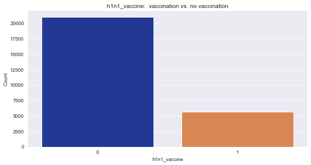
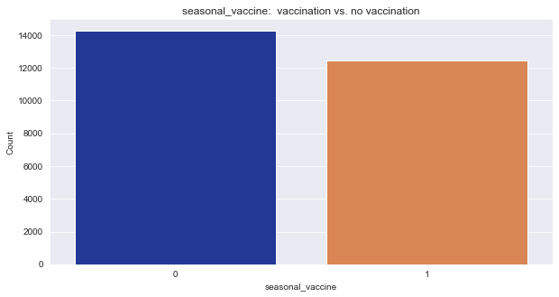
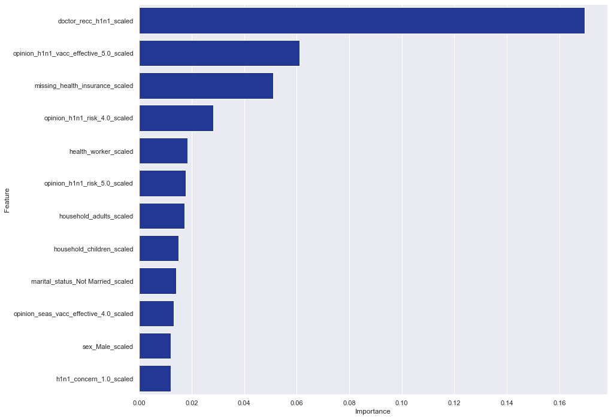
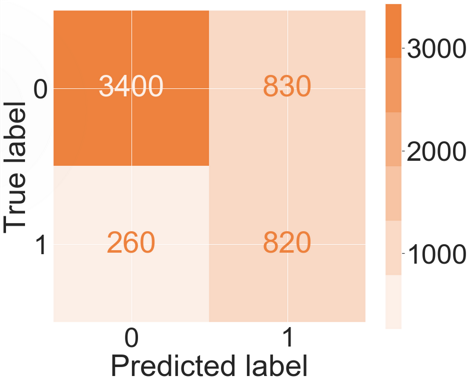
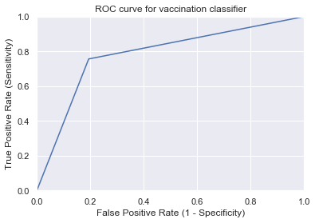
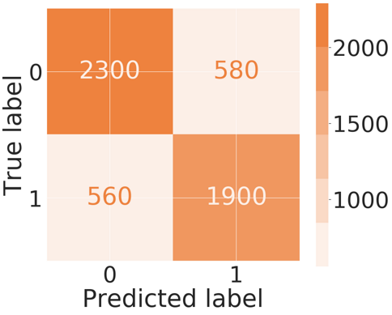
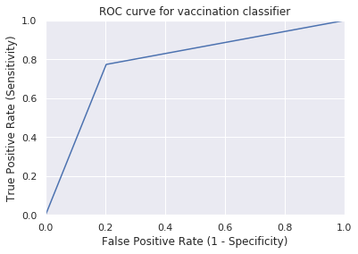

# predicting_vaccinations
Predicting vaccinations to determine demand as well as specific ways to increase demand using survey data.

## Business Case

A pharmaceutical company that develops a vaccination for the H1N1 virus wants to gain a better understanding of the demand for the H1N1 vaccine compared to the seasonal flu vaccine as well as specific ways the company's marketing department could increase the demand for the vaccine.

Big Day has been tasked with conducting exploratory data analysis to identify the most important features for determining if a person will get the H1N1 vaccination and with developing a binary classification model to predict whether a person will get the vaccination or not.

## Dataset

The U.S. Department of Health & Human Services alomg with the National Center for Health Statistics launched a national telephone survey to gather data from a sample of the U.S. population to make predictions about H1N1 and Seasonal Flu vaccinations.

**Target:**
  * H1N1 Vaccination: Did the survey respondant receive the vaccine or not?
  * Seasonal Flue Vaccination: Did the survey respondant receive the vaccine or not?

In addition to these target features, there are additional survey questions regarding the respondent's health behavior, perception of virus risk and communication with their doctor.  These questions will help to reveal the most important factors that lead to vaccination.

The survey data can be found at this link: [National 2009 H1N1 Survey](https://www.drivendata.org/competitions/66/flu-shot-learning/page/210/)

## Target Review

This project contains two target variables: H1N1 Vaccination and Seasonal Flu Vaccination.  Below is a distribution of both variables.  There is a clear imbalance in the H1N1 Vaccination meaning there are far more people in the sample who did not receive this vaccine than people who did receive it.  Seasonal Flu vaccine has a higher percentage of usage and therefore the classes are fairly well balanced.

 

## EDA, Hypothesis Testing & Feature Importance

We used visualizations and Chi-Squared tests for cateogrical data to determine which features appeared to have a relationship with the target variables of H1N1 and seasonal vaccinations.

We dramatically decreased our p-value to run these Chi-Squared tests to avoid false positives, so any feature with a passing p-value is strongly correlated.

There are several features with a strong correlation with the target variable, including:
  * Doctor reccomendation for seasonal vaccine
  * Opinion seasonal vaccine effectiveness
  * Opinion seasonal flu risk
  

  
## Predictive Modeling H1N1

Based on Accuracy and Area Under the Curve (AUC), our best model appears to be Logistic Regression with an accuracy of .796, a harmonic F1-Score of .781 and an Area Under the Curve of .601.

It is important to note that this model is more tolerant of false positives with a precision rate of .498 and a total of 826 false positives on the test set.  The model prioritizes false negatives with a recall of .756 and a total of 264 false negatives on the test set.

**Fasle Positives** = predicted that people did vaccinate when they didn't.  This person would receive marketing materials to schedule a vaccination with their doctor even though they may not be convinced of the risks of the H1N1 virus or the effectiveness of the vaccine.  

**False Negatives** = predicted that people did not vaccinate when they actually did.  This person would receive marketing materials about the risks of the virus and the effectiveness of the vaccine even though they are already convinced and are ready to vaccinate.

## Predictive Modeling Seasonal Flu Vaccine

Based on Accuracy and Area Under the Curve (AUC), our best model appears to be Logistic Regression again with an accuracy of .786, a harmonic F1-Score of .786 and an Area Under the Curve of .770.

## Recommendations

**Direct Marketing**

If the pharmaceutical company could develop relationships with doctors and pharmacies that deliver vaccinations, then they could provide a two-pronged approach of providing marketing/ educational materials as well as increasing doctor recommendations during a patient's visit.

  * Educational materials in the waiting room to build awareness of the risks of H1N1 as well as the effectiveness of the vaccine 
  * Help doctors make recommendations for H1N1 vaccine.

**Lead Qualification**

The company could also create a targeted digital marketing campaign with a lead capture survey including the most relevant questions from the federal survey and use the data collected to qualify leads with the Logistic Regression classifier.  The prediction would would trigger specific marketing actions for the two different groups.  For example, if someone is predicted not to vaccinate, then the person could be routed to a webpage containing information about the risks of H1N1 and the effectiveness of the vaccine and also recieve marketing emails if they opted in.

To mitigate the inevitable false positives, the marketing material should include two CTAs (Call to Actions): 1) get more information about the virus and vaccine and 2) schedule a doctor's visit for vaccination.  Depending on the person's response, the company would be able to further qualify the lead.

## Next Steps

  * Use other models, including a neural network, to see if this increases the accuracy, F1 score, and AUC of the predictive model.
  * Setup a pipeline that can be integrated into the company's marketing strategy and software to improve lead qualification.
  
